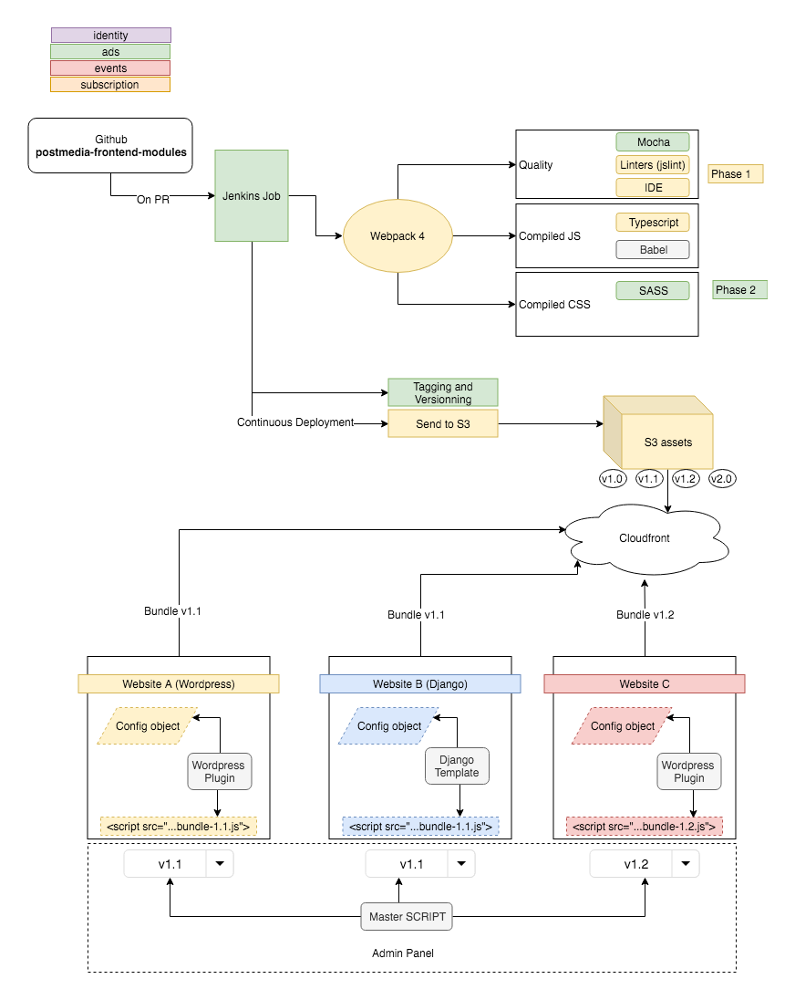
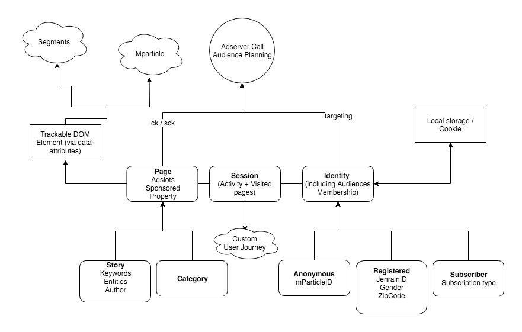

# READ THIS README BEFORE WRITING ANY LINE OF CODE !!!!!!!!

# DO'S AND DONT'S

## DO
- *COMMUNICATE WITH THE OTHER DEVS*. This script is a collaborative effort. Contact the others. Check latest committers, check who is the last person working on your script. Contact them. Say hello. Ask questions. Propose your help.
- Split up your modules as much as you want, but do it with a purpose. 
- if a part of your code can be reused, coordinate with other devs to share the same common script to import and use it (utility functions, common config objects, etc)
- Keep the same prefix (ads.xxx.ts , ads.yyy.ts) or insert related modules in a folder (ads/xxx.ts , ads/yyy.ts) .
- Write modular, testable code and tests for all code committed. Aim for 100% coverage.
- Manage dependencies using NPM. Use `npm search` if you are looking for a dependency, use `npm install xxx --save` or `npm install yyy --save-dev` to add third party script. etc

## DON'T
- Don't think it's OK to add code and refactor it later.
- Don't use Postmedia object anymore. Use the new configuration object uiConfig.
- DO NOT mix back-end generated code and Javascript. At all. Anymore. If you need backend generated values, store them by extending uiConfig object and then use it in your code. 
- Don't use `setInterval()` unless needed, and include it in a promise. And ensure to `clearInterval()` !!
- Don't access DOM and base your logic on it. Or at leat, try not to. Forget about `if(getElementByID('here')){do_something()}`
- Don't load a new dependency without a reason. 


# To initialize the dev environment
```
npm i
```
(short for `npm install`)

# While you are coding
```
npm run develop
npm run develop -- --open  <- to open in default browser
npm run develop -- --open 'Safari'  <- to open in specific browser
```

# To run tests
```
npm test
```

View line-by-line coverage report at `build/reports/unit/coverage/lcov-report/index.html`

# To auto-lint your code
```
npm run lint:fix
```

# When committing/pulling
- Linting and tests are run on staged files for every commit. Both must pass in order to commit.
- When `package.json` has changed after pulling/merging, `npm install` should run automatically.

# To bundle the package for production
```
npm run build
```

# A useful tutorial
https://www.sitepoint.com/beginners-guide-webpack-module-bundling/
https://dev.to/shoupn/debugging-typescript-using-vscode-and-chrome-5am1



More details about Jenkins Pipeline is available at the [documentation](docs/jenkins-pipeline.md) page.



# Usage

[Check out the examples](docs/example/index.md) for usage, and how to connect your app to functionality provided 
by this package. 
