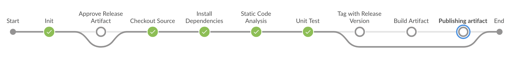
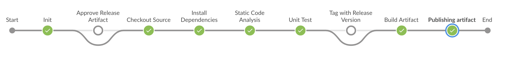
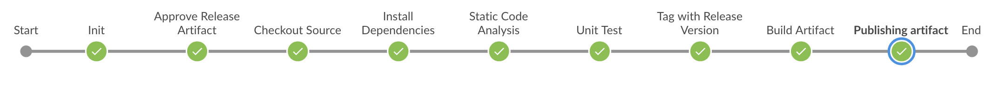

# Jenkins Pipeline

Jenkins Pipeline Job is available at https://jenkins.stage.postmedia.digital/job/postmedia-frontend-modules

## Validation rules implemented in Jenkins Pipeline

- Release Candidate Branch name should be like this `release_candidate_x.y.z` (x: major version; y: minor version; z: patch version)
- Hotfix Branch name should be like this `hotfix_x.y.z` (x: major version; y: minor version; z: patch version)
- Pull Requests are only allowed from Release Candidate or Hotfix branch for the `master` branch
- Creating Release Artifact directly From `master` branch is not allowed. It can be created only from either Release Candidate or Hotfix branch.

## Jenkins Pipeline Flow

### Regular CI Job Flow (without creating artifact)

_Applicable for:_

- For any branches, when git commits and pushes to remote origin
- For any PRs, when git commits and pushes to remote origin

### CI Job flow when create Snapshot Artifact

_Applicable for:_

- Feature branches
- pre-RC pod base branches

### CI Job flow when create Release Artifact

_Applicable for:_

- Release Candidate branches
- Hotfix branches
